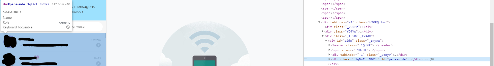
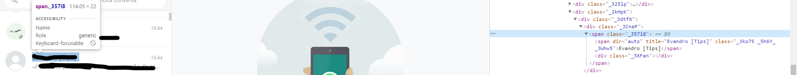
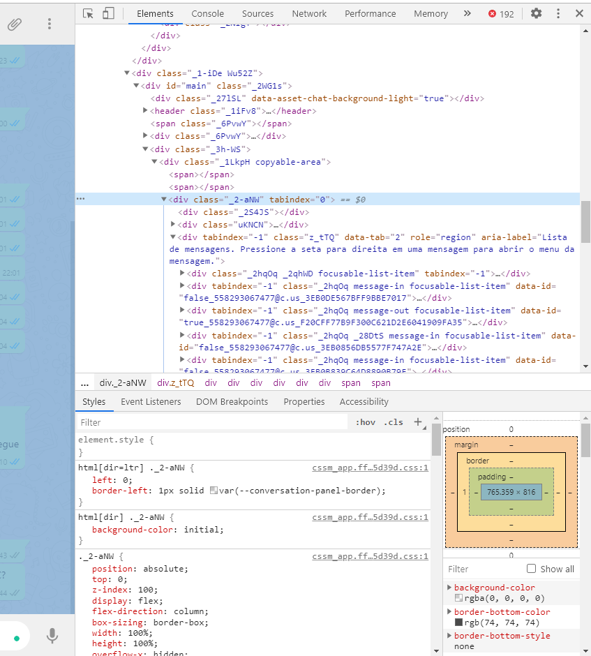
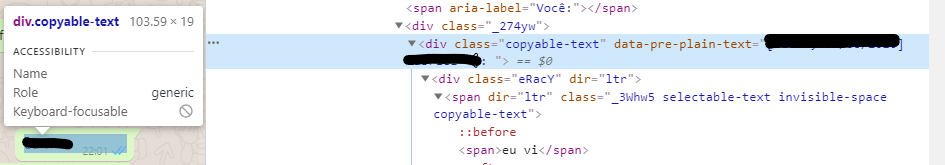

# Whatsapp Web Scraping
Just a simple WhatsApp web scraping to collect conversation data.

## To run:
 - Download [ChromeDriver](https://chromedriver.chromium.org/downloads "ChromeDriver")and place it in the utils folder, if you prefer you can install it and add it to the PATH system
 - Install all dependencies with the command `pip install requirements.txt`
 - After that, run the command `python main.py` and wait for the page to open and show the whatsapp-web interface
 - Use the QR code to connect to WhatsApp and then press Enter on the command line
 - Wait for the program to run and enjoy the collected data ^^
 
## Know troubles:
 It may happen that the WhatsApp changes the name of the CSS classes it uses, if it occurs, the program won't be able to get the contact list, scroll the side-pane, or get the messages. To solve this, you must search for the current CSS class name and change it in the code. To help with this, below are some print screens indicating the CSS classes used

<kbd></kbd>
<kbd></kbd>
<kbd></kbd>
<kbd></kbd>
